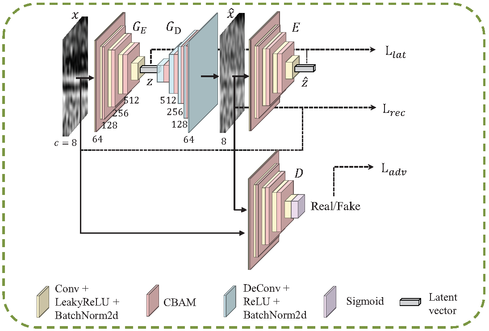

## Introduction
[**MFR**](https://www.sciencedirect.com/science/article/abs/pii/S003132032400966X), included by *Pattern Recognition'2025*, is a novel semi-supervised anomaly detection framework for network traffic based on **M**ulti-**F**requency **R**econstruction manner. It aims to employ simple yet effective data extraction to enhance traffic modeling from frequency domain. This repository contains the corresponding source code for model implementation. **Note**: The filter technique described in paper is not included in the model code. Please ensure that this implementation is introduced during data preprocessing.

## Datasets
- DataCon2020 dataset is collected from https://datacon.qianxin.com/opendata. 
- CIC-IDS2017 dataset is downloaded from https://www.unb.ca/cic/datasets/ids-2017.html. 
- USTC-TFC2016 dataset is downloaded from https://github.com/echowei/DeepTraffic.

## Pipeline


## Requirement
**Hardware** : NVIDIA GeForce RTX 3090 GPU.  
**Software** : Ubuntu 18.04 LTS + Python 3.9 + Pytorch 1.8.

## Code Architecture
- Our model architecture is stored in model.py, which can be easily embedded into your projects.
- The corresponding loss is stored in loss.py.

## Citation
😀 If you use or are inspired from this work please cite:
```
@article{lian2025semi,
title = {Semi-supervised anomaly traffic detection via multi-frequency reconstruction},
author = {Xinglin Lian and Yu Zheng and Zhangxuan Dang and Chunlei Peng and Xinbo Gao},
journal = {Pattern Recognition},
pages = {111215},
year = {2025},
publisher={Elsevier}
}
```